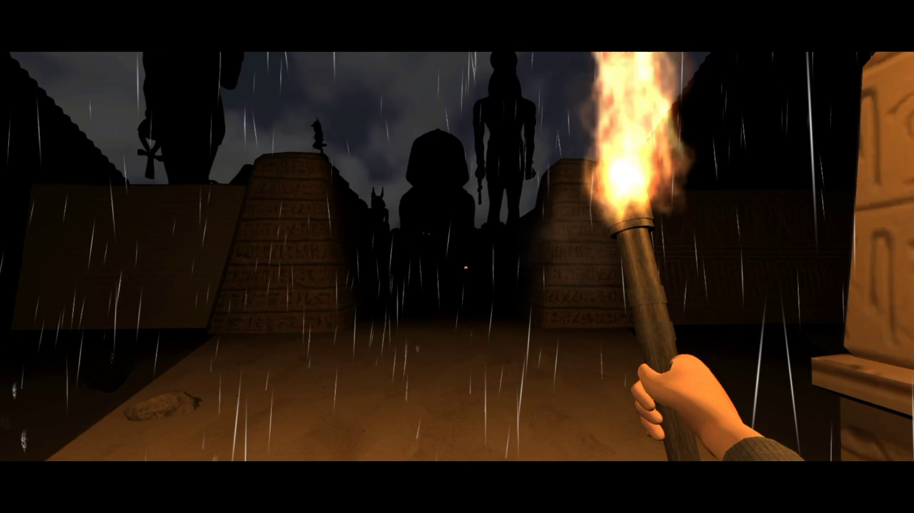

# The Ancient Labyrinth

 About the game
 ===========
The Ancient Labyrinth is a first-person survival horror game developed with Unity and released on Steam. Development began in 2017 and lasted 6 months initially. In 2019 I took it up, refactored and completed it, thanks to the new game programming skills acquired at AIV, Rome.

From September 25, 2019 it is available on Steam: https://store.steampowered.com/app/1150400/The_Ancient_Labyrinth/
